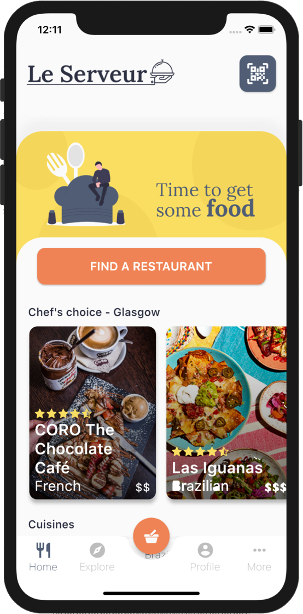
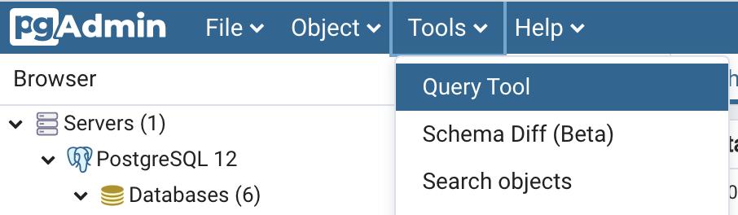
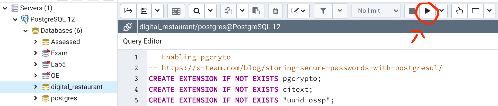
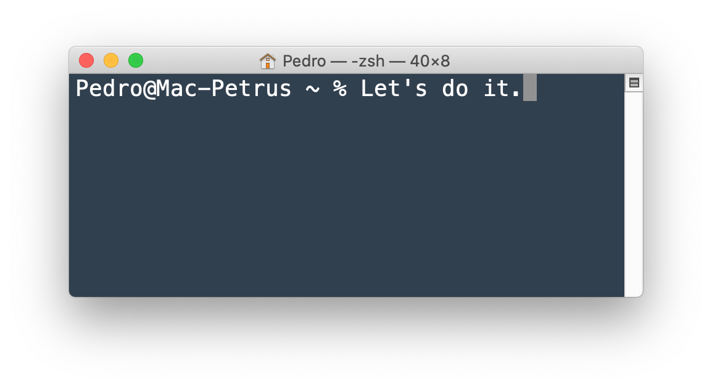
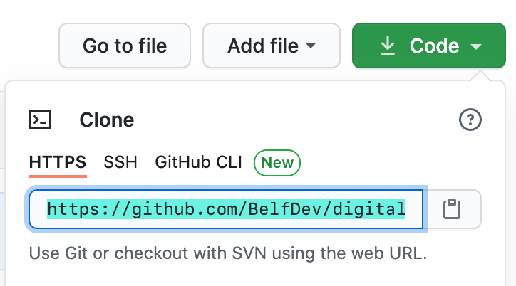
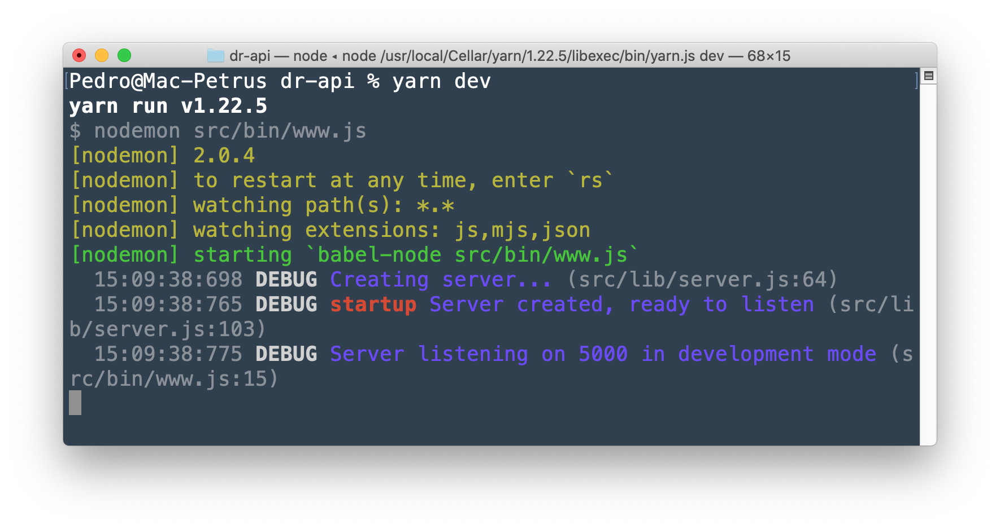

<h1 align="center">
  
  <br>
  <br>
  [COVID-19] Digital Restaurant (API)
  <br>
</h1>

<p align="middle">
  
  
</p>

## Summary

The purpose of this research project was to devise a cross-platform mobile application that reimagined the eating out experience in view of the disruptions caused by the COVID-19 pandemic. The resulting product sought to maximise convenience and, at the same time, facilitate compliance with safety measures imposed by governments around the world. By adopting "Le Serveur", users were able to explore restaurant options, check-in at selected outlets, pick their favourite dishes from food menus, place orders, and express check-out at their preferred time.

## API Reference

### Cuisine
| Path | Method | Description |
|----------------|-----------------|
|`/cuisines`| GET | Retrieves all available cuisine options |
|`/cuisines/:id`| GET | Retrieves a cuisine option by the given integer identifier |
<br>

### Cuisine


## Running the project

Read the instructions below carefully to run the project on your local machine. Please keep in mind that the "Le Serveur" system also encompasses a [frontend application](https://github.com/BelfDev/digital-restaurant-app), which must be running locally for the product to work as expected.

### Pre-requisites

| Technology | Minimum Version | Instalation Guide |
|----------------|-----------------|-----------------------------|
|**Node** |`v12.17.0` |[Node.js LTS](https://nodejs.org/en/) |
|**Yarn** |`v1.22.5`| [Yarn Installation](https://yarnpkg.com/getting-started/install) |
|**Git** |`v2.0.0`| [Git Docs](https://git-scm.com/downloads) |
|**pgAdmin4** |`v4.23.0`| [pgAdmin Download](https://www.pgadmin.org/download/) |
<br>

You only need a Terminal window to run this project. However, if you want enhanced debugging capabilities, you can select any IDE or code editor of your choosing. The author uses [IntelliJ](https://www.jetbrains.com/idea/), but you can choose any other option with decent Node.js debugging support (e.g. [Visual Studio Code](https://code.visualstudio.com/download)). 

### Database Setup

This application uses a relational PostgreSQL database to store data. The instructions below will guide you on how to configure it adequately. Please note that you **only need to set up the database once**; after that you can just run the backend middleware application.

1. **Open the pgAdmin4 application on your machine.**
2. **Open the Query Tool tab.**
     - *Opening the Query Tool tab*<br>
     ```Tools > Query Tool```
     
     <p align="left">
        
     </p>
     
     *If you cannot access the Query Tool option, try creating a dummy database through the GUI first.*
     
3. **Execute the following commands using the Query Tool.**
    ```sql
   CREATE DATABASE digital_restaurant
           WITH 
           OWNER = postgres
           ENCODING = 'UTF8'
           LC_COLLATE = 'C'
           LC_CTYPE = 'C'
           TABLESPACE = pg_default
           CONNECTION LIMIT = -1;
       
       COMMENT ON DATABASE digital_restaurant
           IS 'Database to store information about the Digital Restaurant e-commerce app.';
   ```
4. **Click on the `digital_restaurant` database using pgAdmin4 GUI.**
5. **Open the Query Tool and populate the database.**
     - *Copying the SQL commands from the [project seeds folder](https://github.com/BelfDev/digital-restaurant-api/blob/feature/wrap-up/src/database/seeders/seed-commands.sql).*<br>
     - *Pasting SQL commands into pgAdmin4's Query Editor*<br>
     <p align="left">
        
     </p>

### Step-by-step

Once you have installed all the pre-requisites, please follow the steps below to run the backend application. You will need to issue a number of commands via your system's Terminal window.

<p align="middle">
    
</p>

1. **Clone the current repository to a local directory in your machine.**
     - *Copying the repository URL*<br>
    <br>
     - *Navigating to the root directory*<br>
    ```cd ~```<br>
     - *Cloning this repository into the root directory*<br>
    ```git clone https://github.com/BelfDev/digital-restaurant-api.git```<br>
     - *Stepping into the project's directory*<br>
    ```cd digital-restaurant-api```

2. **Install all project dependencies.** -- *go back to your Terminal window.*
     - *Installing dependencies declared in `package.json`*<br>
     ```yarn install```
3. **Run the app from the Terminal window.**
     - *Running the app in development mode*<br>
     ```yarn dev```
     <p align="left">
        
     </p>
     
Now you can either use a tool such as [Postman](https://www.postman.com/) to make API requests or just use the [frontend mobile app](https://github.com/BelfDev/digital-restaurant-app) "Le Serveur" for the full experience.
     
## Final Notes

- This product was built for **research purposes** (proof-of-concept); therefore, it *should not be launched into production as is*.
- All data displayed in the App are fake -- restaurants and dishes were populated in the database for demonstration purposes.
- Payment is not integrated with with any payment gate such as [Adyen](https://www.adyen.com/) or [Stripe](https://stripe.com/).
- No credit cards are saved.
- Evaluation survey results suggested that potential users find "Le Serveur" useful and easy to use.
- The app's original design can be accessed via this [link](https://xd.adobe.com/view/96ae6c3c-4155-48aa-6d06-a77ccec9d0d6-e09f/). Ask the author for the password.
- Elapsed time: **2 months**.
